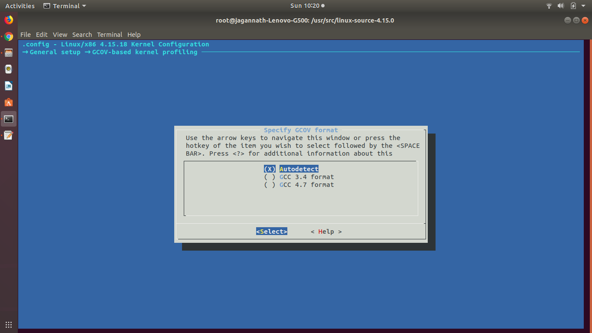

# Configure for GCOV to entire linux kernel

1. copy linux-source-4.15.0.tar.bz2 to /usr/src/
```
    cp linux-source-4.15.0.tar.bz2 /usr/src/ \
    cd /usr/src \
    sudo tar jxvf <name of the package> \
    cd linux-source-4.15.0 \
```

2. Check in correct directory or not?
```
    pwd
    /usr/src/linux-source-4.15.0
```

3. "make mrproper" returns the kernel source tree to its unconfigured state. This means you loose your .config file. You will need to create a new .config file before compiling the kernel.
```
    make mrproper
```

4. Copy the configure file to source directory
```
    sudo cp config-ubuntu-template /usr/src/linux-source-4.15.0/.config
    sudo make oldconfig
```
5. Do the following after
```
    make menuconfig
```



5. Build Kernel
```
    make -j 4
    make modules_install 
    make install 
```